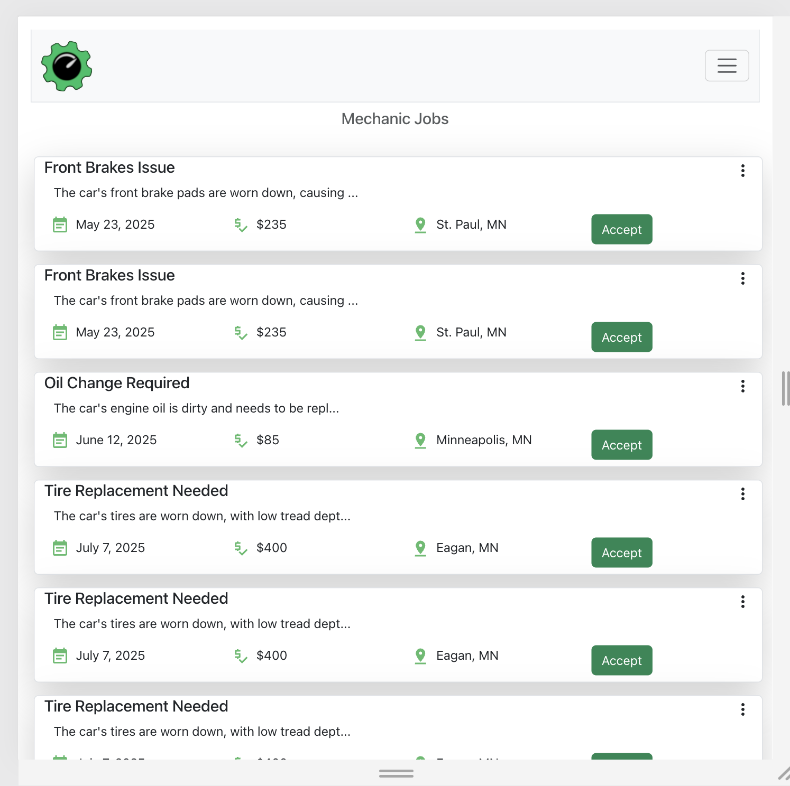
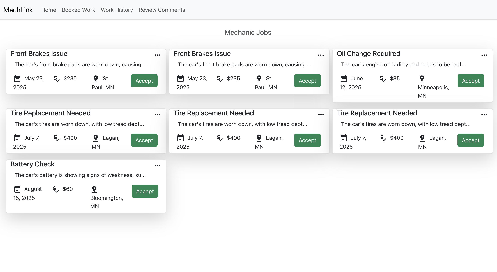
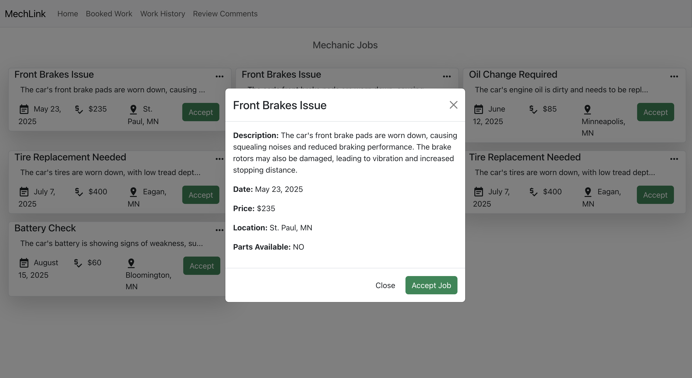
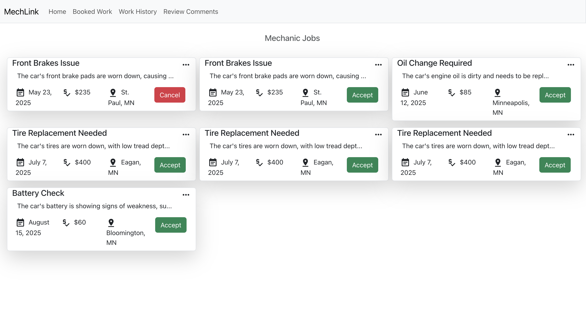
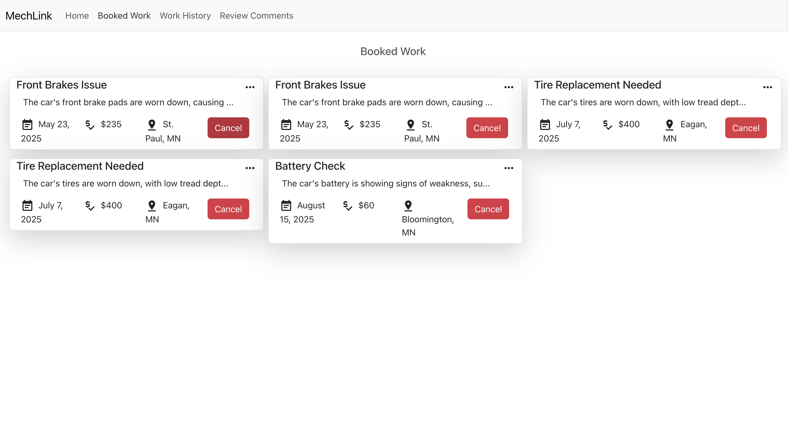
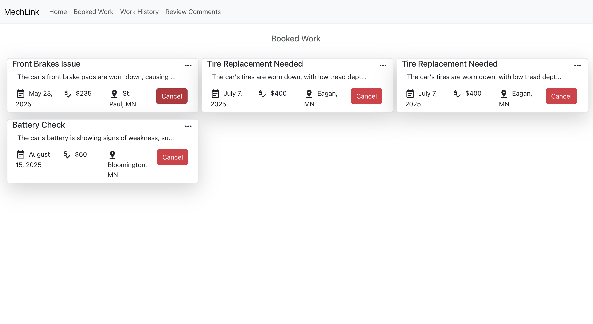

 # Mechanic Home Page Component

The **Mechanic Home Page** component is part of a car service platform, **MechLink**, that connects customers with mechanics for various vehicle services. This project includes interactive elements for managing job postings, accepting or rejecting tasks, and viewing additional details about service requests.

---

## Features

- **Job Listings**: Displays a list of mechanic jobs using the `Row` component.
- **View More Functionality**: Allows users to view detailed information about a job through a modal.
- **Job Acceptance Management**: Enables mechanics to accept or cancel jobs dynamically.
- **Responsive Design**: Built with Bootstrap and custom CSS for cross-device compatibility.

---

## Project Structure

### Main Components

1. **Mechanic_Home_page**
   - Displays all mechanic job postings.
   - Handles the "Accept" and "View More" functionalities.

2. **Row**
   - Represents a single job in the list.
   - Includes job details such as title, date, price, location, and description.
   - Offers interactive options like "Accept" and "View More."

3. **CustomLabel**  
   - Renders labels for job details with custom styling.

4. **BTN**
   - Reusable button component for accept/cancel functionality.

5. **MechLinkLogo**
   - Displays the platform's logo.

### Data Structure
The job postings are managed using a `useState` hook, with each job containing:
- `id`: Unique identifier.
- `title`: Job title.
- `description`: Job description.
- `date`: Scheduled date.
- `price`: Estimated price.
- `location`: Job location.
- `accepted`: Boolean indicating acceptance status.
- `parts_available`: Availability status of required parts.

  ##Images
  

  

---
 
 ## Other screens :
 
 ---
  
  ---
  ---
   
   --
     

 

